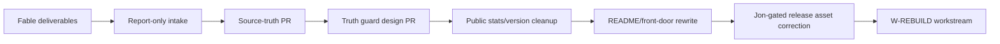

# Garnet 100x Fable Intake - Source-Truth Reconciliation

Created: 2026-06-10
Committed: 2026-06-11 by the S131-S134 consolidation PR (per this file's own
Green list: "Add this intake file"). Episodic record — the baseline line below
was true at authoring time and is one commit stale: current truth at
consolidation is `366e69f` (#380, W-REBUILD pack tracked on main). See
`GARNET_S131_S134_SOURCE_TRUTH_CONSOLIDATION.md` for the live drift map.
Reference note: the two ECC-Prime working docs this file cites
(`GARNET_ECC_PRIME_ASSIMILATION.md`, `GARNET_ECC_PRIME_OVERLAY_RECOMMENDATION.md`)
remain deliberately UNTRACKED pending the needs-Jon decision table in the
consolidation doc — the assimilation doc contains a historical re-cut prompt
that is non-executable under current hard stops and should not enter the repo
without Jon's supersede-or-label decision.
Status: report-only intake and next-action routing
Repo baseline verified: `main == origin/main == 5161e64eeb796f5764909a1e5643eb47d5d72430`
Purpose: assimilate the Fable second-pass deliverables without letting them
replace Garnet's repo-native source of truth, dogfood gates, or Jon-owned
release decisions.

## Inputs Read

Local Fable outputs:

- `/Users/IDC2.5/Downloads/GARNET_100X_STATUS_REPORT_2026-06-10.html`
- `/Users/IDC2.5/Downloads/GARNET_TRUTH_DRIFT_PUNCHLIST.md`
- `/Users/IDC2.5/Downloads/README_PROPOSED.md`
- `/Users/IDC2.5/.codex/attachments/f1343841-8372-4ee9-9b12-d97eebc98865/pasted-text.txt`

Repo-local coordination files already present in this working tree:

- `F_Project_Management/GARNET_S129_S200_ECC_DOGFOOD_COMMAND_CENTER.md`
- `F_Project_Management/GARNET_GOAL_MODE_KICKOFF_2026_06_10.md`
- `F_Project_Management/GARNET_ECC_PRIME_ASSIMILATION.md`
- `F_Project_Management/GARNET_ECC_PRIME_OVERLAY_RECOMMENDATION.md`
- `F_Project_Management/FLEET_REPORTS/TEMPLATE.md`

## Current Ground Truth Checked

Live/local checks on 2026-06-10:

- `git fetch origin main --tags --prune` succeeded.
- `HEAD` and `origin/main` both resolve to
  `5161e64eeb796f5764909a1e5643eb47d5d72430`.
- There are no open PRs on `Island-Dev-Crew/garnet` at the time of this intake.
- The `v0.8.1` GitHub Release is published, not draft, not prerelease.
- The release assets include valid `garnet-0.8.1-*` package names for CLI
  artifacts, plus two stale VSIX asset names:
  - `garnet-0.7.0-lsp-mvp-darwin-arm64.vsix`
  - `garnet-0.7.0-lsp-mvp-linux-x64.vsix`
- The registry machine count is 80 `p(...)` constructor calls in
  `garnet-stdlib/src/registry.rs`.
- `docs/assets/garnet-logo.png`, used by `README_PROPOSED.md`, is absent.
  Existing nearby image assets are `docs/assets/garnet-promo-poster.png` and
  `docs/icons/garnet-192.png` / `docs/icons/garnet-512.png`.
- `docs/getting-started.html` exists.
- `C_Language_Specification/GARNET_v1_0_Mini_Spec.md` exists.
- `FAQ.md#whats-the-capability-model` maps to an existing FAQ heading.

## High-Level Verdict

Fable's second pass is useful and should be assimilated, but not as a blind
rewrite.

The punch-list correctly identifies public truth drift and a real need for a
machine-generated truth surface. The proposed README is a strong front-door
candidate, but it contains several claim and asset assumptions that must be
softened or fixed before replacement. The seven rebuild verdicts are valuable
as a future hardening workstream, but they are not source-of-truth cleanup and
should not be mixed into the immediate PR.

The right move is:



## Traffic-Light Routing

### Green - Safe For The Source-Truth PR

These can be included in the next source-of-truth PR as report-only or
documentation-consolidation material:

- Add this intake file.
- Keep the Fable punch-list as cited input, either copied into
  `F_Project_Management/` or summarized in a repo-local report.
- Add or keep the S129-S200 command center and fleet report template.
- Record that public truth drift exists in README, FAQ, `docs/index.html`, and
  `CURRENT_STATE.md`.
- Record that the registry machine count is currently 80 primitives.
- Record that the release VSIX assets are stale-versioned and require a
  Jon-gated correction path.
- Record that the proposed README should be used as a candidate, not applied
  directly.
- Record that ECC-Prime/Fable workflow is advisory and Garnet dogfood/readiness
  remains authoritative.

Recommended validation for this PR:

```sh
python3 scripts/check-agent-contracts.py
python3 scripts/test_check_agent_contracts.py
git diff --check
```

### Amber - Separate Guarded PR, Not The Source-Truth PR

These are legitimate next steps, but they should be split into focused PRs with
normal verification:

- Implement `cargo xtask truth` or equivalent `xtask truth`.
- Stamp README/FAQ/site numbers from machine truth.
- Change CI or dogfood checks to fail on public truth drift.
- Replace the README with a revised version of `README_PROPOSED.md`.
- Rework public website "By the Numbers" into generated/stamped data.
- Start the bitset `CapSet(u16)` rebuild.
- Start crash-surface hardening with clippy unwrap/expect policy.
- Generate stdlib bridge dispatch from a single primitive declaration source.

Reason: these affect code, CI, public claims, or gate behavior. They deserve
their own PRs, focused tests, and dogfood evidence.

### Red - Jon-Gated Or Decision-Gated

These must not be performed by an autonomous source-truth cleanup lane:

- Delete or retag `v0.8.1`.
- Replace release assets on the published GitHub Release.
- Regenerate and publish `SHA256SUMS.asc` for release assets.
- Install ECC hooks into the main Garnet checkout.
- Modify release gates, dogfood thresholds, diff-caps thresholds, capability
  manifest standards, or CI authority rules without explicit human approval.
- Claim production, 1.0 readiness, full OS-sandbox enforcement, Wasmtime fuel,
  or cross-OS seccomp enforcement.
- Treat a self-authored red-team pass as independent verification.
- Retire the bespoke VM in favor of Cranelift or Wasm/Wasmtime without a
  decision document and parity plan.

## README Proposed - Required Fixes Before Adoption

`README_PROPOSED.md` is directionally strong: it is shorter, public-facing,
more readable, and correctly centers agent-authored code review, diff-caps, and
trust artifacts.

Before it can replace `README.md`, revise these points:

- Replace or add `docs/assets/garnet-logo.png`; the path is currently missing.
- Soften "No ambient authority, ever." The current compiler enforces declared
  capability propagation for known surfaces, but OS sandbox enforcement remains
  Linux-only for seccomp and deferred elsewhere.
- Verify or soften "every crossing is logged." If the claim is not backed by a
  deterministic repo test or evidence artifact, make it aspirational or remove
  it.
- Avoid "no FFI" if it implies Garnet has no host boundary or bridge complexity.
  The repo has process/host authority boundaries and named-deferred FFI-related
  work; the phrase should become "no separate language FFI for the managed/safe
  mode boundary" only if that exact claim is true.
- Keep "enforced kernel" tightly scoped to `@caps` and `@max_depth` traps on
  the interpreter and VM, plus `diff-caps` rejection. Do not let the README imply
  full OS sandbox enforcement on macOS or Windows.
- The final Bible quote and Huntsville signature are brand choices. They may be
  right for Jon's public voice, but they should be accepted intentionally rather
  than inherited from an autonomous rewrite.
- Keep the honest status table, but ensure every number is generated or
  traceable to a current machine source.

## Truth Guard Recommendation

Fable's `xtask truth` idea is correct in spirit: Garnet should stop hand-typing
public numbers that can be derived from machine truth.

Recommended shape:

```text
cargo xtask truth
  emits docs/truth.json
  derives primitive_count from garnet-stdlib registry
  derives workspace/version fields from Cargo metadata and git tags
  derives readiness fields from existing Garnet reporters
  checks README/FAQ/docs truth markers in --check mode
```

However, this should be a separate guard PR because it may touch `xtask`, public
docs, and CI. If CI or dogfood gate behavior changes, require human review under
the existing release/gate integrity rules.

## Rebuild Verdicts - Where They Belong

Fable's seven rebuild verdicts should become a later workstream named
`W-REBUILD`, after the source-truth and front-door cleanup is stable.

Recommended order, with boundaries:

1. `CapSet(u16)` bitset and XOR diff-caps optimization.
   - Smallest likely correctness-preserving win.
   - Must prove no diff-caps semantic change.
2. Crash-surface hardening.
   - Convert user-facing aborts into diagnostics.
   - Do not blanket-deny `expect` until invariant locations are classified.
3. Registry-derived stdlib dispatch.
   - Strongest source-of-truth cleanup for primitives.
   - Needs bridge parity tests before deleting hand-maintained paths.
4. Rowan-only syntax substrate.
   - Correct direction, but high blast radius.
   - Delete legacy CST only after LSP/parser parity is proven.
5. Interned symbols and resolved slots.
   - Performance work after check/interp contracts are stable.
6. Backend decision: Cranelift or Wasm/Wasmtime.
   - Decision-gated. Do not treat as an implementation slice until a parity,
     sandbox, performance, and seal artifact plan exists.
7. Reedline REPL.
   - Useful public joy surface and demo surface.
   - Can run in parallel after primitive metadata and diagnostics are stable.

## Source-Truth PR Shape

Recommended immediate PR:

```text
Title: S131 source-truth intake: Fable 100x drift map + fleet command center

Scope:
- report-only project-management docs;
- no README replacement;
- no release asset mutation;
- no CI/gate changes;
- no ECC hook install;
- no code behavior change.

Files:
- F_Project_Management/GARNET_100X_FABLE_INTAKE_2026_06_10.md
- F_Project_Management/GARNET_S129_S200_ECC_DOGFOOD_COMMAND_CENTER.md
- F_Project_Management/GARNET_GOAL_MODE_KICKOFF_2026_06_10.md
- F_Project_Management/GARNET_ECC_PRIME_ASSIMILATION.md
- F_Project_Management/GARNET_ECC_PRIME_OVERLAY_RECOMMENDATION.md
- F_Project_Management/FLEET_REPORTS/TEMPLATE.md
```

Acceptance:

- `python3 scripts/check-agent-contracts.py`
- `python3 scripts/test_check_agent_contracts.py`
- `git diff --check`
- PR body explicitly states that Fable/ECC are advisory and Garnet gates remain
  authoritative.
- PR body explicitly states no release/tag/asset action was taken.

## Drop-In Prompt For Fable Or Claude Code

Use this if Fable/Claude is about to process the source-truth PR:

```text
ROLE: Garnet post-v0.8.1 source-truth consolidation lane.

MISSION:
Ingest the Codex command-center docs and Fable 100x deliverables as advisory
inputs, then prepare a report-only source-truth PR. Do not replace README.md,
do not implement xtask truth, do not modify CI/gates, do not rebuild internals,
do not install ECC hooks, and do not touch release tags or release assets.

SOURCE OF TRUTH:
- current Island-Dev-Crew/garnet main after `git fetch origin main --tags --prune`
- `/AGENTS.md`
- `F_Project_Management/AGENTS.md`
- `F_Project_Management/GARNET_100X_FABLE_INTAKE_2026_06_10.md`
- `F_Project_Management/GARNET_S129_S200_ECC_DOGFOOD_COMMAND_CENTER.md`
- Garnet dogfood/readiness gates

TASK:
Create or update only report/project-management docs needed to make the next
S131-S200 runway coherent across machines. Preserve calibrated honesty:
research-grade prototype, no production/1.0 claim, Linux-only seccomp
application, macOS/Windows OS-sandbox deferred, self-authored red-team evidence
not independent.

VALIDATION:
Run:
1. `python3 scripts/check-agent-contracts.py`
2. `python3 scripts/test_check_agent_contracts.py`
3. `git diff --check`

OUTPUT:
Open a PR whose body says:
- this is report-only;
- ECC/Fable is advisory, Garnet gates are authoritative;
- no release/tag/asset/gate/CI mutation occurred;
- next PRs should be split into truth guard, public stat cleanup, README rewrite,
  Jon-gated VSIX asset correction, and W-REBUILD.
```

## Final Recommendation

Proceed with the source-truth PR, but keep it intentionally boring.

The boring PR is what unlocks the powerful work: it gives every machine and
agent the same current map, then lets the next lanes attack truth guard,
front-door quality, release asset correction, and rebuild work without mixing
proof, copy, gates, and release operations into one unstable bundle.
