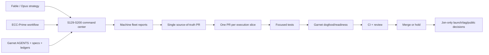
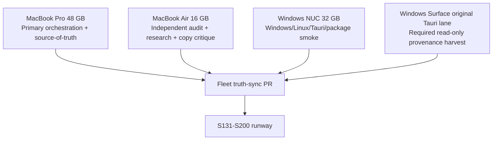
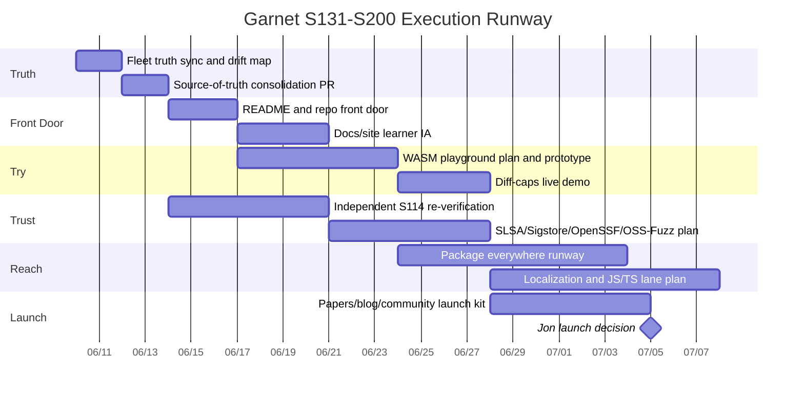
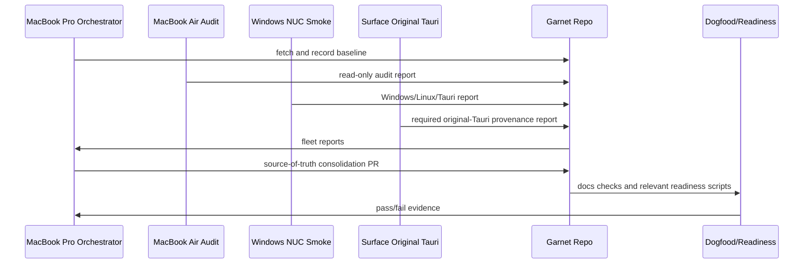

# Garnet S129-S200 ECC Plus Dogfood Command Center

Created: 2026-06-10
Updated: 2026-06-11 (S131-S134 consolidation: baseline refresh, W-REBUILD
runway registration, standing competitive-watch slice)
Status: operational handoff and goal-mode prompt pack
Scope: post-S130 consolidation, S131-S200 execution, and multi-machine goal-mode
coordination

This file corrects the passive "overlay" framing. The intended system is not
ECC-Prime sitting beside Garnet. The intended system is:

```text
ECC-Prime workflow discipline + Garnet dogfood/readiness gates = faster work
with Garnet-native truth control.
```

ECC-Prime supplies the workflow pressure: planner, reviewer, security critique,
research synthesis, loop discipline, and multi-agent coordination. Garnet
dogfood/readiness supplies the acceptance authority. Fable/Opus/Codex can
propose, review, and accelerate. Garnet gates decide.

## Verified Baseline On 2026-06-10

Live checks from the MacBook Pro repo at `/Users/IDC2.5/Desktop/Garnet`:

- `origin/main`: `5161e64eeb796f5764909a1e5643eb47d5d72430`
- latest main commit: `S130 post-re-cut truth-sync: docs now reflect the SIGNED v0.8.1 binaries (#379)`
- `v0.8.1` annotated tag target: `8107c01a59a3f84925e9a4880a29a07a32b408eb`
- `v0.8.1` release: published, not draft, not prerelease
- release assets include: `SHA256SUMS`, `SHA256SUMS.asc`, `.deb`, `.rpm`, two
  darwin CLI tarballs, CycloneDX SBOM, and two VSIX assets
- open PRs on `Island-Dev-Crew/garnet`: none observed
- GitHub stars observed: 1
- Cargo workspace packages observed: 14
- tracked implementation plan: 87/87 slices, 100.0%
- MIT/productization readiness: active-partial, 92.8%

Current drift confirmed by local/live checks:

- `README.md` still says current main is post-v0.5.0 source.
- `README.md` still says 24 stdlib registry primitives bridged through the
  interpreter, while `CURRENT_STATE.md` reports 77 registry primitives.
- the `v0.8.1` release still carries VSIX assets named
  `garnet-0.7.0-lsp-mvp-darwin-arm64.vsix` and
  `garnet-0.7.0-lsp-mvp-linux-x64.vsix`.
- `CURRENT_STATE.md` still contains historical v0.5.0/v0.7.0 release-asset
  references that need context-sensitive cleanup rather than blind deletion.

### Baseline Refresh - 2026-06-11 (S131-S134 consolidation)

The block above is preserved as the 2026-06-10 episodic record. Live checks
from the MacBook Pro consolidation lane on 2026-06-11:

- `origin/main`: `366e69f28812732df2f18fa6b80e1581dd7ac2d9`
  (`docs: add W-REBUILD foundation-rebuild workstream pack (#380)`) — the
  W-REBUILD pack is now TRACKED on main under `F_Project_Management/W_REBUILD/`.
- `v0.8.1` unchanged: annotated tag `4a6442d` peeling to `8107c01`, local ==
  origin; release published, 9 assets. Wording rule (MBP Codex P0): signed
  checksums/assets, never "signed tag" — `git tag -v v0.8.1` finds no tag
  signature.
- Open PRs at consolidation time: `#381` (MacBook Air Claude fleet report) —
  absorbed into the S131-S134 consolidation PR per the report-transport rule.
- All six fleet reports are consolidated in
  `F_Project_Management/FLEET_REPORTS/` (core four + Air Claude + Surface
  provenance).
- Tracked readiness: 87/87 slices, 100.0%. MIT/productization: `active-partial`,
  92.8% (a stale-checkout NUC run reported 89.1% — checkout 76 behind, expected
  delta, see the NUC reports).
- The consolidated drift map and the per-artifact verdicts now live in
  `F_Project_Management/GARNET_S131_S134_SOURCE_TRUTH_CONSOLIDATION.md`; the
  research reassessment lives in
  `research/2026-06/GARNET_REASSESSMENT_2026-06-11.md` (the former
  `F_Project_Management/RESEARCH/` path is a compatibility pointer).

Fable-capture inputs used as strategic proposals:

- repo front door is too auditor/internal for first contact;
- website/docs need a learner-facing structure and a real playground;
- distribution reach is too narrow;
- community/public launch should wait until strangers can try Garnet in the
  browser;
- security baseline is strong but reviewer-proofing needs independent S114
  re-verification plus SLSA/Sigstore/OpenSSF/OSS-Fuzz style hardening;
- global reach needs localization and TypeScript/JavaScript planning;
- Garnet's calibrated-honesty voice is the asset to protect.

Fable's 2026-06-10 second-pass deliverables are routed through
`F_Project_Management/GARNET_100X_FABLE_INTAKE_2026_06_10.md`. Treat that file
as the current traffic-light map for what belongs in a report-only
source-truth PR, what needs a separate guarded implementation PR, and what stays
Jon-gated or decision-gated.

The paste-ready system kickoff sheet is
`F_Project_Management/GARNET_GOAL_MODE_KICKOFF_2026_06_10.md`. Use it when
launching fleet reports, source-truth consolidation, W-REBUILD lead mode, or
parallel Mac/Windows/Air verification lanes.

## Core Alignment

The shared target is not "make Garnet look bigger than it is." The target is:

```text
Make Garnet's public surface, installation path, demo path, trust evidence, and
agent workflow quality finally match the engineering substance already present,
without inflating claims.
```

That means the next runway should optimize for:

1. one repo-visible source of truth across all machines;
2. a stranger-readable front door;
3. a try-in-30-seconds experience before public launch;
4. reviewer-proof trust evidence;
5. cross-platform distribution and smoke proof;
6. language utility that follows the original integrate-don't-rebuild thesis;
7. a launch packet Jon can use without surrendering release/publication control.

## The Working Equation



ECC is allowed to make work sharper. It is not allowed to make truth looser.

## Recommended Machine Topology

Use the three-machine builder topology by default. Keep the Surface paused as a
future builder, but treat it as a required read-only provenance lane because it
was the original Tauri worker.



Minimum viable setup:

- MacBook Pro: Claude Fable 5 Ultracode + Codex.
- Windows NUC: Claude Fable 5 Ultracode + Codex.

Recommended setup:

- MacBook Pro: orchestration, source-of-truth, docs/site front door, final PR
  assembly.
- Windows NUC: Windows/Linux/Tauri/package evidence and cross-OS smoke.
- MacBook Air: read-only independent audit, research, website/README critique,
  presentation prep.
- Surface: required read-only original-Tauri provenance manifest; paused as a
  builder, not omitted from fleet truth.

## Phase Runway

The Fable capture's strongest strategic ordering is correct: do not launch
before the playground exists. The S131-S200 runway should therefore be organized
as gates/phases, not as a blind numeric march.



## Gate Map

| Band | Purpose | Acceptance authority | Notes |
|---|---|---|---|
| S131-S134 | Fleet truth sync, drift map, command center | repo docs + `check-agent-contracts` | Report-only first; no feature work until reports converge. |
| S135-S140 | README, repo front door, docs/site truth cleanup | docs checks + dogfood where applicable | **= W-REBUILD RB-0 band** (RB-0a truth guard, RB-0b README, RB-0c version narrative, RB-0d site stats/VSIX-prep/blog-draft) executed per `W_REBUILD/W_REBUILD_SPEC.md` §3. Fix the confirmed README/version/primitive drift. |
| S141-S150 | Independent trust and reviewer-proof security | independent reviewer + Garnet gates | **Trust band runs PARALLEL to W-REBUILD on other lanes** (Air/NUC/independent reviewer). ECC can package evidence, not self-grade independence. |
| S151-S165 | Playground and try-in-30-seconds path | browser proof + deterministic examples | Launch is blocked until this exists. Consumes the RB-6 backend decision + queued error-recovery work. |
| S166-S178 | Distribution reach | package smoke + OS-specific evidence | NUC-led; the NUC Claude fleet report carries the S166-S178 draft slice plan. Homebrew/winget/scoop/Nix/Docker/devcontainer/VSIX publishing plans. |
| S179-S190 | Language utility expansion | tests + deterministic traps | Wasmtime fuel, in-toto seal, registry MVP, TypeScript/JavaScript planning. |
| S191-S200 | Launch readiness and v0.8.2 gate | dogfood/readiness + Jon | Draft posts are okay; posting/cut decisions stay Jon-owned. |

### W-REBUILD Registration (completes the spec's P0 runway duty)

Registered 2026-06-11 by the S131-S134 consolidation PR, per
`F_Project_Management/W_REBUILD/W_REBUILD_SPEC.md` §0/§2 (the pack itself
landed on main in #380):

- **RB-0 band ≡ S135-S140 front-door band** — same territory the gate map
  reserves; executed with the prepared artifacts (`README_PROPOSED.md`,
  `GARNET_TRUTH_DRIFT_PUNCHLIST.md`), one slice per PR.
- **RB-1..RB-7 = the Foundation workstream** — runs between the front-door
  band and the playground band (S151-S165). It takes no S-numbers; while
  RB-1..RB-5 are in flight, `garnet-check`, `garnet-interp`, `garnet-stdlib`,
  `garnet-parser`, and `garnet-cst` are frozen to the lead lane.
- **Trust band S141-S150 proceeds in parallel on other lanes** (independent
  S114 re-verification, SLSA/Sigstore planning); surfaces do not collide.
- Deploy gate (spec §1) status is tracked in
  `GARNET_S131_S134_SOURCE_TRUTH_CONSOLIDATION.md`; RB execution does not
  start until the gate passes and Jon lights the lane.

### Standing Slices

- **Quarterly competitive watch** (reassessment Gap 7): one report-only slice
  per quarter tracking new entrants in agent-native languages, agent-sandbox
  runtimes, attestation tooling, and agent governance/standards. The durable
  contract is `research/QUARTERLY_COMPETITIVE_WATCH.md`; reports land under
  `research/competitive-watch/`. The first report is planned for 2026 Q3 and
  due 2026-09-30; the contract does not claim it ran. Misses are recorded as
  search-coverage statements, never as proof of absence.

### Synthesis Queue (reassessment infusion, 2026-06-11)

Inputs pre-routed into the post-W-REBUILD synthesis session (sourced from
`research/2026-06/GARNET_REASSESSMENT_2026-06-11.md` §5/§7; the synthesis itself
happens with the W-REBUILD final report + the consolidated fleet truth + this
command center on the table, per `W_REBUILD_SPEC.md` §5):

- **→ W-TRUST (S141-S150): OQ-9 loop-benchmark pre-registration.** Measure
  agent iterations-to-green and capability-widening-diff rate, Garnet vs Rust
  vs Python on matched tasks. Pre-register like Paper VI BEFORE running — the
  result either powers the launch or redirects it, and a pre-registered miss
  is calibrated honesty working, not a failure.
- **→ W-SHIP (S166-S178): the Core Ring.** Ring Tier 1 (serialization, HTTP
  client/server, regex, time, fs, proc, crypto/hashing) consumes the RB-3
  `#[garnet_primitive]` binding factory; **Ring Tier 1 + the MCP/tool-server
  library are a W-LAUNCH gate condition** — no public launch wave on an empty
  shelf (Directive 14; Stroustrup's "saved by luck" regret is the cautionary
  precedent).
- **→ W-LAUNCH (S179-S200) positioning:** the regulatory `--evidence` framing
  (CRA Art. 14 applies from 2026-09-11 — the seal/SBOM/manifest pipeline as a
  compliance asset, documentation-first, mechanism already exists) + the
  three unrealized-use-case briefs from reassessment §3: delta-certification
  envelope mode, the insurer/underwriting brief, the metered-delegation
  budget lattice. All three are post-v0.8.2 skins over the existing kernel;
  zero engineering before then.
- **Marquee discipline (Gap 4):** memory primitives + typed actors STAY in
  the language and EXIT launch headlines pending their own prior-art pass —
  the trust kernel leads; unvetted novelty claims beside vetted ones cheapen
  both. This demotes a founding pillar from the marquee and was argued, not
  assumed (reassessment §5 "Remove/Demote/Decline" carries the reasoning).

## Presentation-First Priorities

For tomorrow's presentation, prioritize what makes the project coherent and
credible, not what maximizes code churn.

Must have:

1. One sentence positioning:
   "Garnet is a research-grade language prototype for making agent-authored code
   reviewable, capability-bounded, and trust-artifact native."
2. Truth slide:
   signed v0.8.1, 14 crates, 87/87 tracked slices, 92.8% productization
   readiness, no production/v1.0 claim.
3. Gap slide:
   front door, playground, distribution, independent S114 re-check, localization,
   TypeScript/JavaScript lane.
4. Workflow slide:
   ECC workflow paired with Garnet dogfood/readiness, not replacing it.
5. Next runway:
   fleet consolidation -> front door -> playground -> trust hardening ->
   distribution -> launch.

Should not rush before tomorrow:

- crate directory de-suffixing;
- root corpus moves;
- CI gate changes;
- release/tag operations;
- public launch posts;
- full ECC hook install;
- security overclaims.

## Consolidation Protocol

**Status 2026-06-11: COMPLETE.** All six fleet reports are consolidated under
`F_Project_Management/FLEET_REPORTS/` by the S131-S134 source-of-truth PR; the
per-artifact verdicts, needs-Jon decision table, and live-verified drift map
are in `GARNET_S131_S134_SOURCE_TRUTH_CONSOLIDATION.md`. The protocol text
below is preserved as the procedure of record for future fleet runs. One
transport lesson is now folded in: the lane prompts must carry the
push-the-fleet-branch step inline (three of five lanes wrote their report but
did not push, because the transport rule lived only in this section).

Before S131 implementation, collect fleet reports from each active machine/agent.

Target directory:

```text
F_Project_Management/FLEET_REPORTS/
```

Template:

```text
F_Project_Management/FLEET_REPORTS/TEMPLATE.md
```

Required reports for the core run:

- `2026-06-10_macbook-pro_claude-fable.md`
- `2026-06-10_macbook-pro_codex.md`
- `2026-06-10_windows-nuc_claude-fable.md`
- `2026-06-10_windows-nuc_codex.md`

Recommended additional reports:

- `2026-06-10_macbook-air_claude-fable.md`
- `2026-06-10_macbook-air_codex.md`

Required original-lane provenance reports:

- `2026-06-10_surface_original-tauri_claude-fable.md`
- `2026-06-10_surface_original-tauri_codex.md`

If the Surface is physically unavailable or too slow to complete both reports
before consolidation, the consolidation PR must record that as
"Surface provenance unavailable/deferred by Jon" rather than treating absence as
evidence that nothing exists there.

Each report must say what exists locally, what differs from `origin/main`, which
artifacts are safe to commit, what must never be committed, and which local
paths/checkouts were searched.

Transport rule: each lane writes its report on a dedicated
`fleet/2026-06-10-<machine>-<agent>` branch and opens no PR. MacBook Pro Claude
fetches those branches and creates the single S131-S134 source-truth
consolidation PR. This avoids competing docs PRs in `F_Project_Management/`.

Bounded sweep rule: each machine searches targeted roots and artifact patterns
for up to 90 minutes, then records exact coverage. A report should say
"searched these roots with these patterns; not an exhaustive disk audit" when
appropriate.

The first consolidation PR should be docs/report-only. It should not restructure
the repo, rename crates, change gates, or edit CI. Its job is to make the fleet
state visible.

Repo-committed Claude Code configuration, such as `.claude/settings.json`,
project skills, slash commands, or subagents, is useful but belongs in a later
Jon-approved `FLEET-TOOLING` PR after source-truth consolidation. Do not add it
silently during fleet reporting.

## Fleet Data Flow



## ECC Plus Dogfood Operating Rules

ECC workflow may:

- create plans;
- identify risks;
- propose tests;
- run code/security/docs review;
- help split work into lanes;
- help keep long sessions from drifting;
- produce report-only handoffs.

ECC workflow may not:

- replace Garnet dogfood/readiness;
- install hooks into Garnet without Jon's explicit approval;
- modify gates, CI, diff-caps thresholds, capability-manifest standards, or
  release policy without Jon;
- claim independent red-team status when invoked by the build/proof lane;
- push tags or make release decisions;
- call something "enforced" without a deterministic trap.

Garnet dogfood/readiness must remain:

- the acceptance authority for merge confidence;
- the source of calibrated pass/fail evidence;
- the guard against false production/v1.0 claims;
- the final check after ECC has helped plan/review.

## Universal Goal-Mode Preamble

Paste this before any lane-specific goal prompt if the tool accepts a preamble.

```text
You are working on Garnet after signed v0.8.1 and S130.

ECC-Prime is a workflow discipline, not a source of truth. Use ECC-style
planning, review, research, security critique, and loop control to improve the
work. Garnet's AGENTS.md files, current repo state, dogfood/readiness gates,
deterministic proof artifacts, and Jon's release boundaries are authoritative.

Do recon first:
- read /AGENTS.md;
- read the closest child AGENTS.md for any subsystem you touch;
- git fetch origin main --tags --prune;
- record git status, HEAD, origin/main, open PRs, and current release truth;
- never assume another lane's result without checking repo/GitHub truth.

Hard stops:
- never push a tag;
- never cut or re-cut a release;
- never install full ECC or enable ECC hooks inside Garnet unless Jon explicitly
  asks in the current session;
- never edit gates/CI/diff-caps/capability standards/release policy without Jon;
- never claim production or v1.0;
- never claim "enforced" unless a deterministic trap proves it;
- keep S114 self-verified status labeled until an independent adversarial
  re-verification is done by an actually independent lane.

For implementation PRs:
- one slice or one coherent docs/report slice per PR;
- focused tests first;
- run the appropriate Garnet verification ladder;
- run dogfood-readiness when the lane is readiness-sensitive;
- record exact commands and pass/fail evidence;
- stop and report after each PR or blocked gate.
```

## Core Four Goal Prompts

These are the four primary prompts for Mac and Windows, Claude and Codex.

### 1. MacBook Pro - Claude Code Fable 5 Ultracode

Use this as the primary orchestration lane.

```text
ROLE: Claude Code Fable 5 Ultracode on MacBook Pro - Garnet S131-S200 Workflow Lead.

MISSION:
Pair ECC-Prime workflow discipline with Garnet dogfood/readiness gates to move
Garnet from signed v0.8.1/S130 into a coherent S131-S200 runway. Do not treat
ECC as authority. Use it as the planner/reviewer/security/research loop that
feeds Garnet's gates.

SOURCE OF TRUTH:
- /Users/IDC2.5/Desktop/Garnet
- /AGENTS.md
- F_Project_Management/AGENTS.md
- F_Project_Management/GARNET_S129_S200_ECC_DOGFOOD_COMMAND_CENTER.md
- F_Project_Management/FLEET_REPORTS/
- live GitHub repo Island-Dev-Crew/garnet
- current Garnet dogfood/readiness scripts

RECON:
1. cd /Users/IDC2.5/Desktop/Garnet
2. git fetch origin main --tags --prune
3. git status --short --branch
4. git rev-parse HEAD origin/main
5. git log --oneline -8
6. gh pr list --repo Island-Dev-Crew/garnet --state open --json number,title,headRefName,author,updatedAt,url
7. gh release view v0.8.1 --repo Island-Dev-Crew/garnet --json tagName,name,isDraft,isPrerelease,publishedAt,url,targetCommitish,assets
8. python3 scripts/garnet_readiness_status.py --format json
9. python3 scripts/garnet_mit_readiness_status.py --format json

FIRST OUTPUT:
Create or update:
  F_Project_Management/FLEET_REPORTS/2026-06-10_macbook-pro_claude-fable.md

Then wait for or ingest fleet reports from:
- MacBook Pro Codex
- Windows NUC Claude
- Windows NUC Codex
- Windows Surface original-Tauri provenance harvest
- MacBook Air Claude/Codex if available

PRIMARY TASK:
Create the source-of-truth consolidation PR for S131-S134. It should be
docs/report-only and should consolidate:
- current repo/release truth;
- confirmed README/site drift;
- fleet artifacts and machine-specific evidence;
- the S131-S200 runway;
- the correct ECC-plus-dogfood framing.

DO NOT:
- install ECC;
- enable hooks;
- rename crates;
- restructure root directories;
- change CI/gates;
- push tags;
- launch publicly.

VERIFY:
For docs/report-only work, run:
1. python3 scripts/check-agent-contracts.py
2. python3 scripts/test_check_agent_contracts.py
3. git diff --check

If you touch Rust or behavior, also run the full relevant cargo ladder.

PR DISCIPLINE:
One PR only for the source-of-truth consolidation. Stop and report after PR
creation or after merge. Do not proceed into implementation slices in the same
goal unless Jon explicitly says continue.
```

### 2. MacBook Pro - Codex

Use this as the repo-truth and gate-pairing verifier.

```text
ROLE: Codex on MacBook Pro - Garnet source-truth and dogfood verifier.

MISSION:
Independently verify the S131-S200 command center and any Claude/Fable output
against live repo truth, AGENTS contracts, and Garnet readiness gates. Treat ECC
as workflow input only.

RECON:
1. cd /Users/IDC2.5/Desktop/Garnet
2. read AGENTS.md and F_Project_Management/AGENTS.md
3. git fetch origin main --tags --prune
4. git status --short --branch
5. git rev-parse HEAD origin/main
6. gh pr list --repo Island-Dev-Crew/garnet --state open --json number,title,headRefName,author,updatedAt,url
7. gh release view v0.8.1 --repo Island-Dev-Crew/garnet --json tagName,publishedAt,url,targetCommitish,assets
8. python3 scripts/garnet_readiness_status.py --format json
9. python3 scripts/garnet_mit_readiness_status.py --format json

OUTPUT:
Create or update:
  F_Project_Management/FLEET_REPORTS/2026-06-10_macbook-pro_codex.md

Then review the command center and any source-of-truth PR for:
- stale S129/S130 assumptions;
- release/tag overclaims;
- README/site drift claims that are not backed by grep/live checks;
- dogfood/readiness gates being replaced by ECC language;
- "independent" red-team wording that is actually self-authored;
- production/v1.0 or "enforced" claims without traps.

VERIFY:
Run:
1. python3 scripts/check-agent-contracts.py
2. python3 scripts/test_check_agent_contracts.py
3. git diff --check

If a PR is open, inspect CI and PR body evidence. Do not merge unless the current
established flow explicitly authorizes it and all gates are green.

STOP:
Report findings first, ordered by severity, with file/line references when
possible. Do not fix implementation issues unless Jon asks.
```

### 3. Windows NUC - Claude Code Fable 5 Ultracode

Use this as the Windows/Linux/Tauri evidence and packaging strategy lane.

```text
ROLE: Claude Code Fable 5 Ultracode on Windows NUC - Garnet Windows/Linux/Tauri evidence lane.

MISSION:
Produce the Windows NUC fleet report and prepare the Windows/Linux/Tauri
evidence plan for S131-S200. Use ECC workflow for planning/review, but keep
Garnet dogfood/readiness as acceptance authority.

RECON:
1. Locate the active Garnet checkout.
2. git fetch origin main --tags --prune
3. git status --short --branch
4. git rev-parse HEAD origin/main
5. gh auth status
6. gh pr list --repo Island-Dev-Crew/garnet --state open --json number,title,headRefName,author,updatedAt,url
7. wsl --status
8. wsl -l -v
9. java --version
10. rustc --version
11. cargo --version
12. node --version

OUTPUT:
Create or update:
  F_Project_Management/FLEET_REPORTS/2026-06-10_windows-nuc_claude-fable.md

REPORT:
Document:
- Windows repo path;
- WSL/Debian/UTM or Linux environment available from this machine;
- Tauri build state;
- Java/OpenJDK state;
- local proof artifacts;
- Windows/WSL/Linux smoke commands that pass/fail;
- package artifacts present locally;
- what should be committed, ignored, or copied to MacBook Pro;
- what remains unproven.

NEXT-STEP PLAN:
Draft the Windows/Linux package and smoke plan for the S166-S178 distribution
band:
- Windows installer/CLI smoke;
- Linux desktop GUI proof not confused with WSL portability;
- VSIX naming/publication cleanup;
- winget/scoop feasibility;
- clean-machine evidence requirements.

DO NOT:
- push tags;
- create releases;
- install ECC hooks;
- change gates/CI;
- claim Linux seccomp or OS-sandbox enforcement from WSL;
- claim production/v1.0.

STOP:
After the fleet report and plan, stop for MacBook Pro consolidation.
```

### 4. Windows NUC - Codex

Use this as the cross-OS verifier and reality-check lane.

```text
ROLE: Codex on Windows NUC - Garnet cross-OS verifier.

MISSION:
Verify Windows NUC state independently from Claude/Fable. Produce a concise
fleet report and identify which Windows/Linux/Tauri claims are reproducible now.

RECON:
1. Locate the active Garnet checkout.
2. Read AGENTS.md and the closest relevant child AGENTS.md files.
3. git fetch origin main --tags --prune
4. git status --short --branch
5. git rev-parse HEAD origin/main
6. gh release view v0.8.1 --repo Island-Dev-Crew/garnet --json tagName,publishedAt,url,targetCommitish,assets
7. wsl --status
8. wsl -l -v
9. rustc --version
10. cargo --version
11. node --version

OUTPUT:
Create or update:
  F_Project_Management/FLEET_REPORTS/2026-06-10_windows-nuc_codex.md

VERIFY WHERE APPROPRIATE:
- python3 scripts/check-agent-contracts.py
- python3 scripts/garnet_readiness_status.py --format json
- python3 scripts/garnet_mit_readiness_status.py --format json
- Windows/WSL/Tauri smoke scripts already supported by the repo

REPORT:
- what is byte-identical committed truth;
- what is machine-local evidence only;
- what is Windows proof;
- what is WSL portability only;
- what is clean-Linux proof;
- what is not proven.

STOP:
Do not implement packaging changes in this lane. Return facts and recommended
next commands for the orchestration lane.
```

## Recommended Additional Goal Prompts

Use these if the MacBook Air is available.

### 5. MacBook Air - Claude Code Fable 5 Ultracode

```text
ROLE: Claude Code Fable 5 Ultracode on MacBook Air - Garnet independent audit and public-story lane.

MISSION:
Act as an independent read-only audit/research lane for Garnet's S131-S200
runway. Focus on presentation clarity, README/site critique, research alignment,
and launch readiness. Do not author correctness-critical implementation.

RECON:
1. Locate or clone the Garnet checkout.
2. git fetch origin main --tags --prune
3. git status --short --branch
4. gh repo view Island-Dev-Crew/garnet --json name,owner,url,stargazerCount,forkCount,updatedAt
5. gh release view v0.8.1 --repo Island-Dev-Crew/garnet --json tagName,publishedAt,url,targetCommitish,assets
6. Read README.md, CURRENT_STATE.md, docs/index.html, docs/status.html,
   F_Project_Management/GARNET_S129_S200_ECC_DOGFOOD_COMMAND_CENTER.md.

OUTPUT:
Create or update:
  F_Project_Management/FLEET_REPORTS/2026-06-10_macbook-air_claude-fable.md

AUDIT QUESTIONS:
- Can a stranger understand what Garnet is in 30 seconds?
- Is the README still an internal ledger?
- Which public claims are stale or overcomplicated?
- What needs to be true before launch?
- What screenshots/diagrams would make the presentation clearer?
- Which Fable recommendations are high-impact but unsafe to rush?

DO NOT:
- push tags;
- merge PRs;
- install ECC hooks;
- make release decisions;
- change gate logic.
```

### 6. MacBook Air - Codex

```text
ROLE: Codex on MacBook Air - Garnet independent facts and screenshot verifier.

MISSION:
Produce an independent MacBook Air fleet report and verify the public-site,
README, and release-truth claims that will be used in presentation or S131-S140.

RECON:
1. Locate or clone the Garnet checkout.
2. git fetch origin main --tags --prune
3. git status --short --branch
4. gh release view v0.8.1 --repo Island-Dev-Crew/garnet --json tagName,publishedAt,url,targetCommitish,assets
5. python3 scripts/garnet_readiness_status.py --format json
6. python3 scripts/garnet_mit_readiness_status.py --format json
7. rg -n "post-v0.5.0|24 stdlib|24 registry|24 bridged|v0.5.0 is research-grade|S1 LSP|0.7.0-lsp|monthly is the floor" README.md docs CURRENT_STATE.md

OUTPUT:
Create or update:
  F_Project_Management/FLEET_REPORTS/2026-06-10_macbook-air_codex.md

REPORT:
- exact stale strings found;
- exact files needing first-pass cleanup;
- screenshots worth preserving;
- claims safe for tomorrow;
- claims that need rewording.

STOP:
Report only unless Jon explicitly asks for a docs PR.
```

## Required Surface Original-Tauri Provenance Harvest

The Surface was the original Tauri lane and worker. It is paused as a future
builder because it is slow, but it remains required as a read-only provenance
source for fleet truth unless Jon explicitly marks it unavailable. Keep it
read-only unless Jon explicitly asks otherwise.

### 7. Surface - Claude Code

```text
ROLE: Claude Code on Windows Surface - Garnet original-Tauri provenance harvest.

MISSION:
Inventory Garnet files/artifacts on the Surface because it was the original
Tauri lane and worker. The Surface is paused as a builder, but its historical
evidence is required for fleet truth.

DO:
- locate every Garnet repo/checkout/fork on the machine;
- inspect Desktop, Documents, Downloads, temp folders, WSL home paths, and any
  Claude/Codex working directories for Garnet, Tauri, Studio, VSIX, package,
  screenshot, proof, or release artifacts;
- record local branches, untracked files, proof bundles, downloads,
  screenshots, release artifacts, handoff docs, Tauri build outputs, and WSL
  outputs;
- record paths, timestamps, hashes, and safety notes;
- identify what is already present on origin/main or the Windows NUC;
- assign each artifact a verdict: commit, archive, ignore, duplicate, unsafe,
  or needs Jon.

DO NOT:
- modify repo files;
- push branches;
- install ECC;
- delete anything;
- print secrets.

OUTPUT:
Create:
  F_Project_Management/FLEET_REPORTS/2026-06-10_surface_original-tauri_claude-fable.md
```

### 8. Surface - Codex

```text
ROLE: Codex on Windows Surface - original-Tauri provenance verifier.

MISSION:
Independently verify the Surface artifact inventory and separate original Tauri
evidence, duplicate NUC/main evidence, generated output, unsafe files, and
assets needing Jon.

OUTPUT:
Create:
  F_Project_Management/FLEET_REPORTS/2026-06-10_surface_original-tauri_codex.md

STOP:
No mutation. No deletion. No push.
```

## Kickoff Order

Use this order when starting goal-mode sessions.

1. MacBook Pro Codex:
   verify current command center and create the MBP Codex fleet report.
2. Windows NUC Claude:
   create Windows/Linux/Tauri fleet report.
3. Windows NUC Codex:
   independently verify Windows/Linux/Tauri facts.
4. Surface provenance lane:
   harvest original Tauri evidence read-only.
5. MacBook Air Claude:
   run public-story and research audit.
6. MacBook Air Codex:
   verify README/site/release truth drift.
7. MacBook Pro Claude:
   ingest all reports and create the docs-only source-of-truth consolidation PR.

Fleet reports can run in parallel. MacBook Pro Claude consolidation waits for
the required MacBook Pro, Windows NUC, and Surface provenance reports, or an
explicit Jon note that Surface is unavailable/deferred.

## First Implementation PRs After Consolidation

After the source-of-truth consolidation PR lands, use one PR per item.

Recommended first PRs:

1. README front-door rewrite:
   - <= 180 lines for first contact;
   - fix 24 -> 77 primitive drift;
   - fix post-v0.5.0 wording;
   - link out to internals instead of embedding long script tutorials;
   - preserve calibrated honesty.
2. Release/editor asset naming plan:
   - decide whether stale VSIX names are historical, renamed, or republished;
   - do not rewrite release assets without Jon.
3. Docs/site learner architecture:
   - split Learn / Reference / Internals;
   - keep `docs/status.html` as caveat surface;
   - avoid one-page 390KB public sprawl.
4. Playground plan and prototype:
   - WASM path or browser-hosted deterministic runner;
   - preload diff-caps accept/reject;
   - no launch until this is touchable.
5. Independent S114 re-verification package:
   - evidence bundle for an independent attacker;
   - do not self-grade as independent.

## "Do Not Drift" Checklist

Before every PR:

- Did this start from current `origin/main`?
- Did the lane read root and child `AGENTS.md`?
- Is the PR one coherent slice?
- Are claims calibrated?
- Are machine-local proofs labeled as machine-local?
- Is WSL labeled as execution/portability only where appropriate?
- Is Linux seccomp labeled Linux-only?
- Is macOS/Windows OS sandboxing named as deferred unless trapped?
- Does "enforced" have a deterministic trap?
- Did dogfood/readiness run when the slice affects readiness?
- Is Jon still the only tag/release/public-launch authority?

## Bottom Line

The path forward is a workflow pairing:

```text
Fable/Opus/Codex strategy -> ECC workflow discipline -> Garnet contracts ->
Garnet dogfood/readiness -> CI/review -> Jon-owned release/public decisions.
```

The immediate next move is fleet consolidation, not more feature work. Once the
four or six fleet reports exist, the MacBook Pro can assemble one docs-only
source-of-truth PR. After that, the project can move hard into the front door,
playground, trust-hardening, distribution, language-utility, and launch gates
without losing the truth discipline that made v0.8.1 credible.
